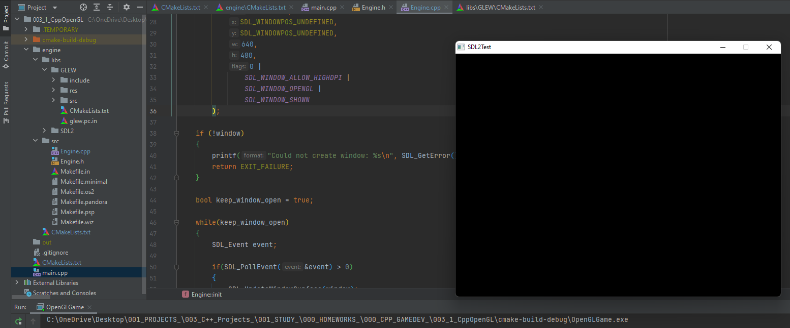

## [_GAMEDEV_][gamedev] > [_003_1_CppOpenGL_][3_1OpenGL]

<!-- ## <p align=center>[Step 1][stp1] | [Step 2][stp2] | [Step 3][stp3] | [Step 4][stp4] | [Step 5][stp5] | [Step 6][stp6] <br/> [Step 7][stp7] | [Step 8][stp8] | [Step 9][stp9] | [Step 10][stp10] | [Step 11][stp11] | [Step 12][stp12]  </p> -->

<!--
* [_GAMEDEV_][gamedev]
* [_003_1_CppOpenGL_][3_1OpenGL]
* [Step 1][stp1]
* [Step 2][stp2]
* [Step 3][stp3]
* [Step 4][stp4]
* [Step 5][stp5]
* [Step 6][stp6]
* [Step 7][stp7]
* [Step 8][stp8]
* [Step 9][stp9]
* [Step 10][stp10]
* [Step 11][stp11]
* [Step 12][stp12]
-->

[gamedev]:   ../README.md
[3_1OpenGL]: README.md
[stp1]:    002_1_BasicStartingPoint/README.md
[stp2]:    002_2_AddingLibrary/README.md
[stp3]:    002_3_UsageReqForLib/README.md
[stp4]:    002_4_InstallAndTest/README.md
[stp5]:    002_5_SysIntrospection/README.md
[stp6]:    002_6_ComFileGen/README.md
[stp7]:    002_7_BuildInstall/README.md
[stp8]:    002_8_Dashboard/README.md
[stp9]:    002_9_StaticShared/README.md
[stp10]:   002_10_GenExpression/README.md
[stp11]:   002_11_ExportConfig/README.md
[stp12]:   002_12_PackDebRel/README.md

---
<!-- ---------------------------------- * Navigation * ---------------------------------- -->

# _003_1_CppOpenGL_ *(C++ Game Development)*

## Theme 3: Main game loop

- Create a CMake project.
- Include Simple DirectMedia Layer 2 (SDL2) library and The OpenGL Extension Wrangler (GLEW) library.
- Libraries must be in the game engine.
- In the Engine class, you need to initialize SDL2 and create the main game window.
- The main window must be kept open until the user closes it.

---

## Minimum Requirements

> ***NOTE***: The project is completely built on SOURCE CODE!<br/> The **SDL2** and **GLEW** libraries are **NOT BINARY**.

**Environment** | **Name** | **Version**
--: | --: | :--
Operating system: | **Windows** | v.*10*
Build system: | **CMake** | v.*3.20*
Compiler: | **MinGW w64** | v.*6.0*
Debugger: | **MinGW GDB** | v.*8.1*
Libraries: | **SDL2** <br/> **GLEW** <br/> **OpenGL** | v.*2.0.18* <br/> v.*2.0* <br/> v.*1.1*

---
<br/>

## Create a CMake project

Project structure

```txt
[root_project]
|─ [build]
|─ [engine]
|   |─ [libs]
|   |   |─ [GLEW]
|   |   |   |─ [include]
|   |   |   |─ [src]
|   |   |   |─ ...
|   |   |   └─ CMakeLists.txt
|   |   └─ [SDL2]
|   |       |─ [include]
|   |       |─ [src]
|   |       |─ ...
|   |       └─ CMakeLists.txt
|   |─ [src]
|   |    |─ Engine.cpp
|   |    └─ Engine.h
|   └─ CMakeLists.txt
|── CMakeLists.txt
└── main.cpp
```

At the root, create a new CMakeLists.txt file with the following context

```cmake
cmake_minimum_required(VERSION 3.20)    # Specifies the minimum required version of CMake

    set(PROJECT_NAME                    # Defines the project name variable
            OpenGLGame                  # Specifies the name of the Game
    )
project(${PROJECT_NAME})                # Set the project name

    set(CMAKE_CXX_STANDARD  17)         # Sets the CMAKE_CXX_STANDARD variable to 2017

add_executable(                         # Adds the target executable application
    ${PROJECT_NAME}                     # The target will be built from the files listed below
        main.cpp
)

# ***** GAME ENGINE INCLUDE *****

add_subdirectory(engine)                # Adds a subdirectory of the engine to the build

target_link_libraries(                  # Links target with GameEngine
    ${PROJECT_NAME}
        GameEngine
)
```

---
<br/>

## Include Simple DirectMedia Layer 2 (SDL2) library and The OpenGL Extension Wrangler (GLEW) library

At the engine directory, create a new CMakeLists.txt file with the following context

### engine/CMakeLists.txt

```cmake
cmake_minimum_required(VERSION 3.20)

    set(PROJECT_NAME
            GameEngine                  # Specifies the name of the Engine
    )
project(${PROJECT_NAME})

    set(CMAKE_CXX_STANDARD  17)

add_library(                            # Adds a Game engine as a library
    ${PROJECT_NAME}                     # The Engine will be built from the files listed below
        ${CMAKE_CURRENT_SOURCE_DIR}/src/Engine.cpp
        ${CMAKE_CURRENT_SOURCE_DIR}/src/Engine.h
)

# ***** SDL2 LIBRARY INCLUDE *****
#find_package(SDL2 REQUIRED)            # DON'T USE IT FOR SOURCE CODE (ONLY FOR BINARY)!

if (NOT IOS)
    add_subdirectory(                   # Adds a subdirectory of the SDL2 library to the build
        ${CMAKE_CURRENT_SOURCE_DIR}/libs/SDL2
    )
        set(SDL2MAIN_LIBRARY
                SDL2main                # Specifies the name of the SDL2 main library
        )
        set(SDL2_LIBRARY
                SDL2-static             # Specifies the name of the SDL2 static library
        )
endif()

# ***** OPENGL SPECIFICATION INCLUDE *****
find_package(OpenGL REQUIRED)           # Scans system for OpenGL and load it up

find_library(                           # Finds a library and stores the result in a variable
    OPENGL_LIBRARY
        OpenGL                          # Specifies the name of the OpenGL library
)


# ***** GLEW LIBRARY INCLUDE *****
#find_package(GLEW   REQUIRED)          # DON'T USE IT FOR SOURCE CODE (ONLY FOR BINARY)!
    set(Defines the project name variable
        GLEW_LIB_DIR                    # Defines the GLEW library path variable
            ${CMAKE_CURRENT_SOURCE_DIR}/libs/GLEW
    )
    set(
        GLEW_LIBRARY
            libglew_static              # Specifies the name of the GLEW static library
    )

add_subdirectory(                       # Adds a subdirectory of the GLEW library to the build
    ${GLEW_LIB_DIR}
)

target_link_libraries(                  # Links the Engine to libraries listed below
        ${PROJECT_NAME}
    PRIVATE                             # The libraries are only available for the Engine
        ${SDL2MAIN_LIBRARY}
        ${SDL2_LIBRARY}
        ${OPENGL_LIBRARY}
        ${GLEW_LIBRARY}
)

target_include_directories(             # Specifies where to find the include directories
        ${PROJECT_NAME}
    PUBLIC                              # Engine headers are available for the entire project
        ${CMAKE_CURRENT_SOURCE_DIR}/src
    PRIVATE                             # SDL2, GLEW headers are only available for Engine
        ${CMAKE_CURRENT_SOURCE_DIR}/libs/SDL2/include
        ${CMAKE_CURRENT_SOURCE_DIR}/libs/GLEW/include
)
```

---
<br/>

## Initializing SDL2 and creating the main game window in the Engine class

#### Engine.h

```cpp
#pragma once

#ifndef ENGINE_H
#define ENGINE_H

#include <memory>

class Engine
{
public:

    explicit Engine();
    ~Engine();

    int init();

private:

    struct Pimpl;
    std::unique_ptr<Pimpl> _pimpl;
};

#endif // ENGINE_H
```

#### Engine.cpp

```cpp
#include "Engine.h"
#include <SDL.h>

struct Engine::Pimpl
{
    SDL_Color color;
};

Engine::Engine()
{
    _pimpl = std::make_unique<Engine::Pimpl>();
    _pimpl -> color;
}

int Engine::init()
{
    if (SDL_Init(SDL_INIT_EVERYTHING) != 0)
    {
        SDL_Log("Unable to initialize SDL: %s", SDL_GetError());
        return EXIT_FAILURE;
    }

    SDL_Init(SDL_INIT_EVERYTHING);

    SDL_Window * window =
        SDL_CreateWindow(
            "SDL2Test",
            SDL_WINDOWPOS_UNDEFINED,
            SDL_WINDOWPOS_UNDEFINED,
            640,
            480,
            0 |
                SDL_WINDOW_ALLOW_HIGHDPI |
                SDL_WINDOW_OPENGL |
                SDL_WINDOW_SHOWN
        );

    if (!window)
    {
        printf("Could not create window: %s\n", SDL_GetError());
        return EXIT_FAILURE;
    }

    bool keep_window_open = true;

    while(keep_window_open)
    {
        SDL_Event event;

        if(SDL_PollEvent(&event) > 0)
        {
            SDL_UpdateWindowSurface(window);

            SDL_Renderer * renderer =
                SDL_CreateRenderer(
                    window,
                    -1,
                    SDL_RENDERER_SOFTWARE
                );

            SDL_SetRenderDrawColor(
                renderer,
                0,
                0,
                0,
                SDL_ALPHA_OPAQUE
            );

            SDL_RenderClear(renderer);
            SDL_RenderPresent(renderer);

            if (event.type == SDL_QUIT)
            {
                keep_window_open = false;
            }
        }
    }

    SDL_DestroyWindow(window);
    SDL_Quit();

    return EXIT_SUCCESS;
}

Engine::~Engine() = default; // for Windows
```

---
<br/>

## Initializing The Game Engine

#### main.cpp

```cpp
#include <iostream>
#include "Engine.h"

int main(int argc, char *argv[])
{

    Engine engine{};
    engine.init();

    return EXIT_SUCCESS;
}
```

---
<br/>

## Build, Compile and Run

> **NOTE**: Minor changes may be required to compile the project on a non-Windows system!

1. Run the PowerShell `[Win]`+`[R]` -> Type: pwsh -> `[Shift]`+`[Ctrl]`+`[Enter]` (to get admin rights)
2. Go to the project root of the Game directory

```bash
cd <your_path_to_the_game_root>
```

3. Copy the command list below

```sh
mkdir build ;
cd build ;
cmake -G "MinGW Makefiles" .. ;
cmake --build . ;
```

4. In a PowerShell window `[Mouse Right click]` (to paste copied commands)
5. Press `[Enter]`
6. Wait for the completion of the generation and build processes
7. To run an executable target in PowerShell use the following command

```bash
Start-process OpenGLGame.exe
```

### The result



---
